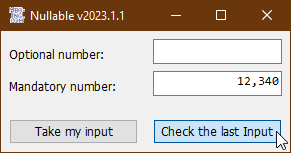
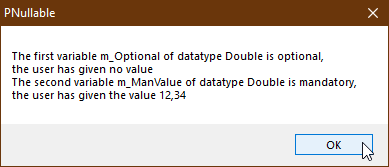

# Langg_Nullable  
## How to make values optional and how to deal with it  

Project started in spring 2009.  
This example shows how to make use of optional user inputs, with the Nullable-class known from .net "?"/ Nullable\<T\>.  

Whenever an input parameter is optional, obviously the user either can give an input or maybe not. 
For example we have a class with a property "Value" of a primitive numeric datatype like Double.
The user makes inputs then clicks OK, then we have to read the input parameters.
All input parameters in the first place are given as strings.
So we as developers have to parse and interpret all strings. A string can be empty.
If one input parameter is "empty" so there is no value given by the user. 
You can let this happen if the parameter is not a mandatory field but optional.
But we can not represent this state of a value with just the Double-datatype itself because
what value in the double-range would you define as "empty"?  
Some ideas how we may deal with the situation:  
* You could say we only want positive values, so a negative value is the value for empty  
* or only negative values, then any positive value is empty  
* or any value without 0, so 0 is the definition for empty  
* or maybe a special value like [IEEE754-NaN](https://github.com/OlimilO1402/IEEE754_Infinity)

None of the above is ideal, in fact they are just workarounds.
You can not reproduce the "optional"-situation afterwards, with a primitive datatype like Double.
So we need to have a chance to determine afterwards whether the user had given inputs or maybe not.  
So this is where the Nullable-class comes in handy.

In VBC/VBA we do not have to fear it because we always had the Variant-Datatype with its VarType set to empty. 
A Variant can either have a value or maybe not and we can determine this situation with the 
functions IsEmpty / Is Nothing.
With the Nullable class that just wraps a Variant you can express the optional situation more clearly and your code
will be much more concise and readable than just by using a Variant, because a simple Variant can have so much more other meanings.

